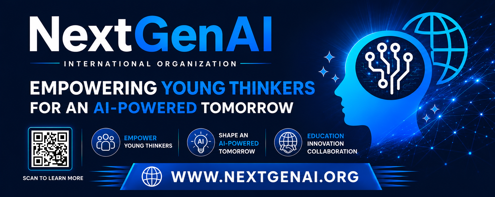

<div align="center">



<br/>

# NextGenAI 🌟

### Empowering Young Thinkers for an AI-Powered Tomorrow

A student-led, mentor-supported global movement equipping high schoolers with ethical AI skills, innovation, and worldwide collaboration.

[](https://www.nextgenai.org)
[](mailto:contact@nextgenai.org)
[](./docs/IMPACT.md)
[](./docs/IMPACT.md)

<br/>


<sub>Animated banner generated from NextGenAI's own site footage (`website/video/hero.mp4`)</sub>

</div>

<br/>

<div align="center">

### 📖 Explore the Repo

[**About**](./docs/ABOUT.md) &nbsp;•&nbsp;
[**Programs**](./docs/PROGRAMS.md) &nbsp;•&nbsp;
[**Impact**](./docs/IMPACT.md) &nbsp;•&nbsp;
[**Get Involved**](./docs/GET_INVOLVED.md) &nbsp;•&nbsp;
[**Leadership**](./docs/LEADERSHIP.md) &nbsp;•&nbsp;
[**Partners**](./docs/PARTNERS.md)

</div>

---

## 🚀 Our Mission

NextGenAI is dedicated to **empowering the next generation of young leaders** to thrive in an AI-driven world through:

- 🎓 **Education** — Hands-on AI learning & ethical awareness
- 💡 **Innovation** — Real-world projects & internships
- 🌍 **Collaboration** — Global networks & cross-cultural exchanges

> The AI revolution is here — youth must lead it ethically. The future starts **today**.

Full mission details, our theory of change, and organizational structure live in [`docs/ABOUT.md`](./docs/ABOUT.md).

## 🛤️ Programs at a Glance

| Track | Focus |
|---|---|
| 📚 [Accelerated AI Learning](./docs/PROGRAMS.md#1--accelerated-ai-learning) | Bootcamps, ethical workshops, UC-approved courses, guest speakers |
| 💻 [Innovation & Internships](./docs/PROGRAMS.md#2--innovation--internships) | Mentored research, prototype building, showcase days |
| 🌍 [Global Outreach & Connect](./docs/PROGRAMS.md#3--global-outreach--connect) | Virtual meetups, student media, community workshops |
| ❤️ [AI Social Impact](./docs/PROGRAMS.md#4--ai-social-impact-with-ai-ethos) | Projects for healthcare equity, sustainability, bias reduction |

Flexible paths — students combine tracks for full impact. Details in [`docs/PROGRAMS.md`](./docs/PROGRAMS.md).

## 📈 Impact So Far

<div align="center">

| 200+ | 10+ | 15+ | 4 | 3 |
|:---:|:---:|:---:|:---:|:---:|
| Participants | Youth-led innovations | Social-good projects | Partnerships | Countries |

</div>

Full timeline, milestones, and testimonials from our mentors and partners: [`docs/IMPACT.md`](./docs/IMPACT.md).

## 🤝 Team & Advisors

| Role | Name |
|---|---|
| President & Founder | Aaryan Samanta |
| Vice President & Founder | Shaayon |
| Mentor | Laurence Dang |
| Mentor | Carlos Febrero |
| Honorary Advisor | Dr. Paul Chan |
| Honorary Advisor | Dr. LiChieh Lin |

Full bios and photos: [`docs/LEADERSHIP.md`](./docs/LEADERSHIP.md).

## 🌐 Partners

- **Academic** — [Legend College Preparatory](https://legendcp.com/) (WASC-accredited, AI-forward high school in Cupertino)
- **Industry** — [Taiwan Artificial Intelligence Industrial Association (TAIA)](https://taiago.com/)
- **Non-Profit** — [AI Ethos, Inc.](https://www.aiethos.org)

More on how we collaborate: [`docs/PARTNERS.md`](./docs/PARTNERS.md).

## 🗂️ Repository Structure

```
nextgen-ai/
├── website/           # Source of nextgenai.org (PHP, CSS, JS, images, video)
│   ├── index.php
│   ├── about.php
│   ├── programs.php
│   ├── impact.php
│   ├── involved.php
│   ├── leadership.php
│   ├── contact.php
│   ├── donate.php
│   ├── header.php / footer.php
│   ├── css/ js/ fonts/ img/ video/
├── docs/              # Long-form organizational content, mirrored from the site
│   ├── ABOUT.md
│   ├── PROGRAMS.md
│   ├── IMPACT.md
│   ├── GET_INVOLVED.md
│   ├── LEADERSHIP.md
│   ├── PARTNERS.md
│   ├── banner.png
│   └── hero-banner.gif
├── .github/           # Issue & PR templates
├── CONTRIBUTING.md
├── CODE_OF_CONDUCT.md
└── LICENSE
```

## 🧑‍💻 Running the Site Locally

The site is built with PHP + Bootstrap. To preview it locally:

```bash
cd website
php -S localhost:8000
```

Then visit `http://localhost:8000`. See [`CONTRIBUTING.md`](./CONTRIBUTING.md) for the full contributor workflow.

## 🙌 Get Involved — Join the Movement!

**Empower Youth. Shape AI. Act Today.**

- **Students** → Sign up for AI Pathways or become a Global AI Ambassador
- **Schools/Educators** → Start an AI club with our resources
- **Partners/Industry** → Guest speak, mentor, sponsor projects
- **Donate** → Support equitable access
- **Volunteer** → Mentor or contribute

<div align="center">

<a href="mailto:contact@nextgenai.org"></a>

</div>

Full details: [`docs/GET_INVOLVED.md`](./docs/GET_INVOLVED.md).

## 📬 Contact Us

**NextGenAI** | Empowering Young Thinkers Globally 🤖🌍

- 📧 General: [contact@nextgenai.org](mailto:contact@nextgenai.org)
- 🌐 Website: [www.nextgenai.org](https://www.nextgenai.org)
- 💚 Donate: [donate@nextgenai.org](mailto:donate@nextgenai.org)
- 🙋 Volunteer: [volunteer@nextgenai.org](mailto:volunteer@nextgenai.org)
- 🤝 Partnerships: [partner@nextgenai.org](mailto:partner@nextgenai.org)

<div align="center">

[](https://www.nextgenai.org)

<br/><br/>

**Together, let's build an equitable, ethical AI future!** 🚀❤️

</div>
