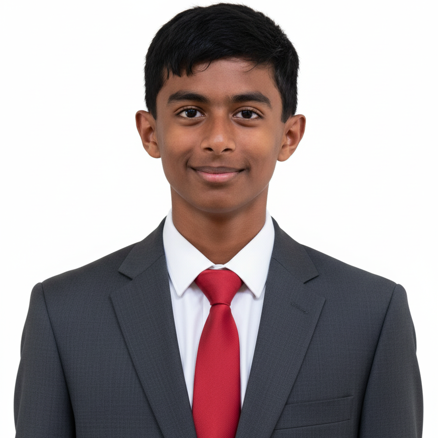
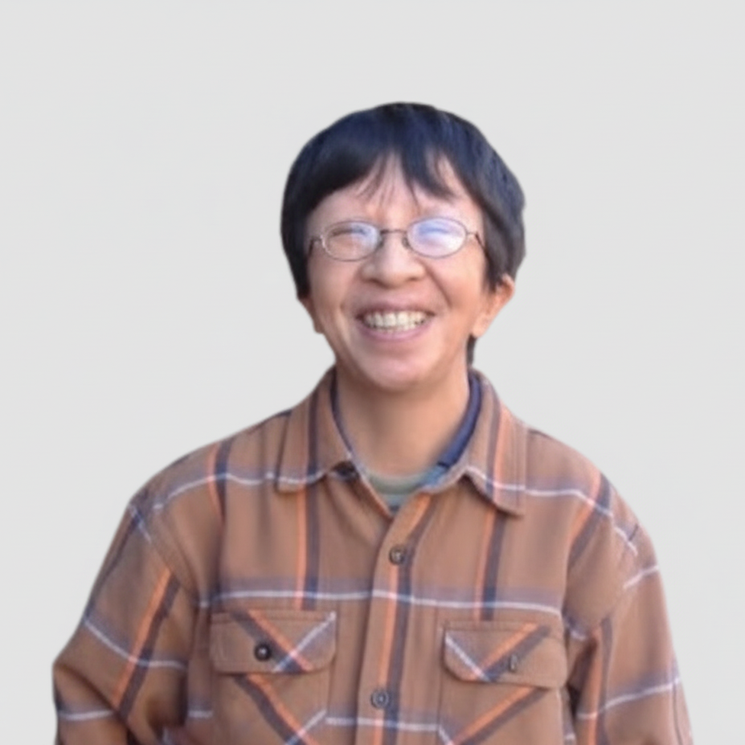
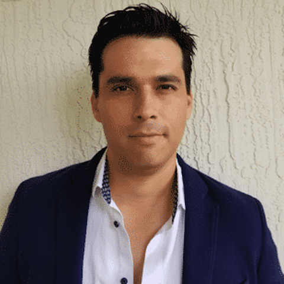
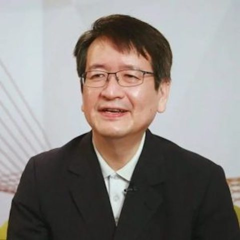

# 🤝 Leadership & Mentors

<table>
<tr>
<td width="120"></td>
<td>

### Aaryan Samanta — President, Founder & CEO

Rising Sophomore & AI Research Enthusiast in Cupertino, California. Founder & President of NextGenAI and President, Founder & CEO of AI Ethos, Inc. Perfect scores in AMC8/AMC10 and USACO Gold/Bronze, AIME qualifier. Conducts research on pneumonia detection with CNNs, ethical AI awareness, and molecular clock technology at UC Santa Barbara. School record holder in track & field; Superior rating in percussion at CMEA Festival. Fluent in Spanish and Bengali.

📧 [president@nextgenai.org](mailto:president@nextgenai.org)

</td>
</tr>
<tr>
<td width="120"></td>
<td>

### Shaayon — Vice President & Founder

6th grade Vice President advancing NextGenAI's mission. 3rd place nationally in Math Kangaroo, 6th place in MathLeague.org state competitions, national qualifier, USA AMC8 Certificate of Achievement. Interests span AI, Computer Science, Advanced Mathematics, Human Anatomy, Genetics, History, and Music Theory. Proficient in Python and Java.

📧 [vicepresident@nextgenai.org](mailto:vicepresident@nextgenai.org)

</td>
</tr>
<tr>
<td width="120"></td>
<td>

### Laurence Dang — Mentor

Academic Dean and Chair of the Department of Mathematics and Sciences at Legend College Preparatory; Director for AI Ethos, Inc. B.S. and M.S. in Applied Mathematics from Santa Clara University, with a research background in image processing and wavelet transforms. Fluent in English, French, and German.

</td>
</tr>
<tr>
<td width="120"></td>
<td>

### Carlos Febrero — Mentor

AI Educator and Lead Engineer based in Fort Lauderdale, FL, specializing in AI, Java, and cloud-native development. Instructs AI Technology, Python, Data Science, and Machine Learning at Legend College Preparatory. Former senior software engineer at Amadeus. Avid BMX enthusiast.

</td>
</tr>
<tr>
<td width="120"></td>
<td>

### Dr. Paul Chan — Honorary Advisor

Founder and Principal of Legend College Preparatory (LCP), a WASC-accredited private high school in Cupertino, California. A forward-thinking leader in personalized education, emphasizing adaptability, academic excellence, and global readiness.

</td>
</tr>
<tr>
<td width="120"></td>
<td>

### Dr. LiChieh Lin — Honorary Advisor

AI Expert & Consultant/Lecturer with the Taiwan Artificial Intelligence Industry Association (TAIA) and Principal of LCP Taiwan. PhD with expertise in AI industrialization, talent development, and ethical innovation, including prior work at IBM Watson Research.

</td>
</tr>
</table>

---

⬅ [Get Involved](./GET_INVOLVED.md) &nbsp;|&nbsp; [Back to README](../README.md) &nbsp;|&nbsp; [Partners ➡](./PARTNERS.md)

